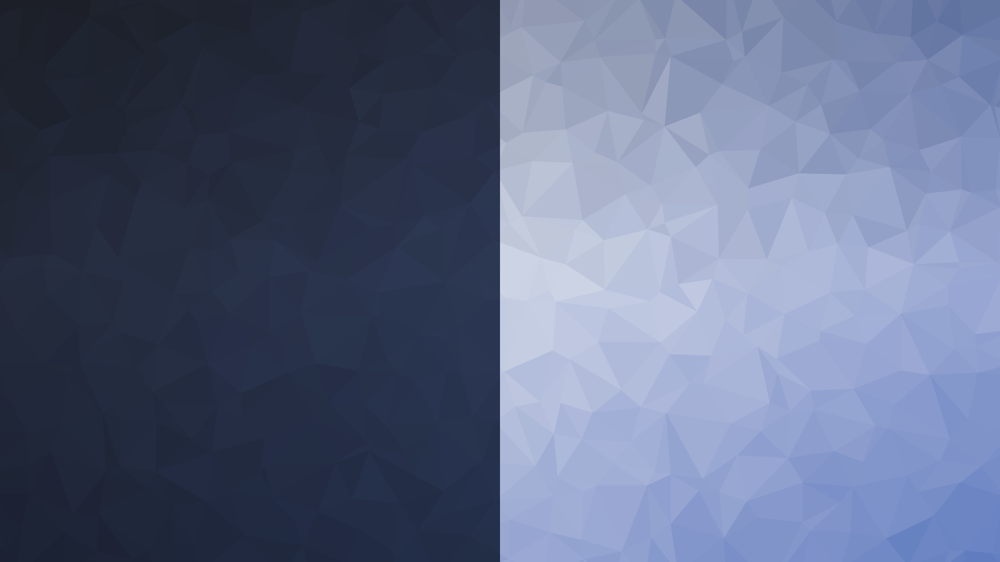

# shibui - a particular aesthetic of simple, subtle, and unobtrusive beauty.

This small project is inspired by [trianglify](https://trianglify.io/). It will generate wallpapers with random patterns from a color palette from a hex.
This project does not have a limit like the web page.

This project will create a light and a dark wallpaper based on the `baseColor`. MacOS users can use a project like [Wallpapper](https://github.com/mczachurski/wallpapper) to create a dynamic wallpaper.



### Prerequisites: 
- Node.js

### Install

``` sh 
git clone https://github.com/brorbw/shibui
cd shibui
npm install
npm run start <path-to-config>
```

#### Example config

``` json
{
	"width": 1920,
	"height": 1080,
	"cellSize": 70,
	"variance": 1,
	"intensity": 0.1,
	"darkenAmount": 0.7,
	"baseColor": "212337"
}
```

#### Configurations


`width` - Width of canvas

`height` - Height of canvas

`cellSize` - Size of triangles

`variance` - Variance in angles

`intensity` - Intensity of the coloring

`darkenAmount` - Amount to darken the dark image

`baseColor` - Color to create color palette on
